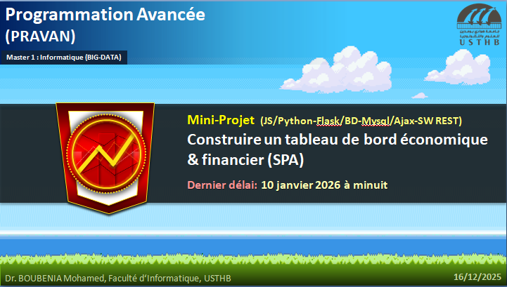

# 📊 Mini-Projet – Construire un tableau de bord économique & financier (SPA)

## 🌍 Préambule — Pourquoi ce projet ?

Les chiffres économiques sont partout : budgets de l’État, inflation, dette, masse monétaire, prix du pétrole…  
Pourtant, **un chiffre seul ne dit rien**.  
Ce qui fait la différence, c’est **la capacité à transformer des données brutes en informations compréhensibles**, puis en **insights utiles**.

Dans le monde professionnel, cette mission est souvent confiée à des outils comme **Power BI**, **Tableau** ou **Qlik**.  
Mais lorsqu’il s’agit de **diffuser ces analyses à des utilisateurs finaux** (citoyens, étudiants, décideurs, journalistes…),  
une **application Web interactive** devient le meilleur support.

👉 Ce mini-projet vous propose de **jouer le rôle d’analyste et de développeur**,  
en construisant **votre propre tableau de bord Web**, à partir de **données économiques réelles**, issues de **sources officielles**.

---

## 🧠 Intitulé du mini-projet

### **Construire un tableau de bord Web pour l’analyse économique et financière**

---

## 🎯 Objectifs pédagogiques

Ce mini-projet a pour objectif de vous permettre de :

- Travailler avec des **données réelles**
- Comprendre et exploiter une **source de données officielle**
- Transformer des données économiques en **questions d’analyse**
- Concevoir un **tableau de bord Web interactif**
- Mettre en œuvre une **architecture Web moderne (SPA)**

### Technologies attendues
- **HTML / CSS**
- **JavaScript**
- **HTTP**
- **Python**
- **Flask**
- **AJAX**
- **Web Services REST**
- **Bibliothèque de visualisation (Chart.js ou équivalent)**

---

## 📌 Principe général du projet

Le projet se déroule en **plusieurs étapes logiques**, similaires à un cas réel en entreprise.

### 1️⃣ Choix et compréhension des données
Chaque équipe doit :
- Identifier une **source de données officielle**
- Comprendre :
  - la nature des données
  - la période couverte
  - les indicateurs disponibles
- Justifier le **choix de la source**

### 2️⃣ Formulation des questions d’analyse
À partir des données choisies, chaque équipe doit définir :

👉 **Au minimum 3 questions** (ou plus)  
👉 Les questions doivent être **liées à l’économie ou aux finances**

#### Exemples de questions possibles :
- L’Algérie dépense-t-elle plus en 2025 que les années précédentes ?
- Quelle est l’évolution de l’inflation annuelle ?
- Comment évolue la masse monétaire ?
- Quelle est la part des dépenses d’investissement dans le budget ?
- Quel est l’impact du prix du pétrole sur les recettes publiques ?

⚠️ Chaque graphique du tableau de bord doit **répondre clairement à une question posée**.

---

## 📊 Analyses et visualisations attendues

- Les analyses doivent être **variées**
- Utilisation obligatoire de **plusieurs types de graphiques** :
  - Courbes
  - Barres
  - Camemberts
  - (autres si pertinent)

👉 **Un graphique = une question = une réponse visuelle claire**

---

## 🗂️ Sources de données autorisées

Vous pouvez utiliser **une ou plusieurs** des sources suivantes :

- 📘 Banque d’Algérie – Rapports annuels  
  https://www.bank-of-algeria.dz/rapports-annuels/

- 📊 ONS – Indice des Prix à la Consommation (IPC)  
  https://www.ons.dz/spip.php?rubrique26

- 📜 Lois de finances  
  https://www.mf.gov.dz/index.php/fr/textes-officiels/lois-de-finances/

- 🌍 Autres sources officielles autorisées :
  - Banque mondiale
  - Prix officiel du baril du pétrole
  - Ministère des Finances
  - Autres organismes publics reconnus

---

## 🧑‍🤝‍🧑 Travail en équipe & Git

- Le projet se réalise **en équipe**
- Chaque équipe doit créer un **compte GitHub** portant le nom :
pravan_2025_team_X

👉 Le numéro `X` de chaque équipe est fourni dans:
https://docs.google.com/spreadsheets/d/1ejF4l5otVQVVAHf9OOmK6-Q5lFBpJpYRPCngaY_Ls5Y/edit?gid=867714338#gid=867714338

### Dépôt Git
- Chaque équipe doit :
  - Cloner le dépôt du mini-projet
  - Travailler avec **le compte de l’équipe**
  - Pusher régulièrement le code (comment ce qu'on faisait en TP)

---

## 📁 Livrables attendus

### 1️⃣ Code source (Git) (ne dépassant pas 20 Mo)
- Application Web fonctionnelle (SPA)
- Backend Flask + Web Services
- Frontend interactif
- Visualisations de données

### 2️⃣ Fichier README.md (obligatoire)
À placer à la racine du dépôt, il doit contenir :
- Le cadre du projet
- Le module concerné
- Les noms des étudiants
- Les concepts clés utilisés
- Les questions d’analyse posées
- Ce que vous avez appris à travers ce projet

### 3️⃣ Rapport écrit (2 à 3 pages)
Le rapport doit expliquer :
- Le contexte économique choisi
- Les concepts clés liés aux questions étudiées
- La motivation derrière chaque question
- Une brève interprétation des résultats

### 4️⃣ Vidéo de présentation (3 minutes)
Une courte vidéo expliquant :
- Le contexte
- Les questions posées
- Le tableau de bord
- Les principaux résultats

---

## ⏰ Date limite de remise

📅 **10 janvier 2026**  
🕛 **à minuit (23h59)**

---

## 🚀 Ce que vous allez vraiment apprendre

Au-delà du code, ce projet vous permettra de :

- Lire et comprendre des **documents économiques réels**
- Poser des **questions pertinentes à partir des données**
- Relier **économie, analyse et développement Web**
- Construire une application proche des **standards professionnels**
- Valoriser un projet **fort** dans votre portfolio

---

💡 *Un bon tableau de bord ne montre pas des chiffres.*  
💡 *Il raconte une histoire, soutenue par les données.*
